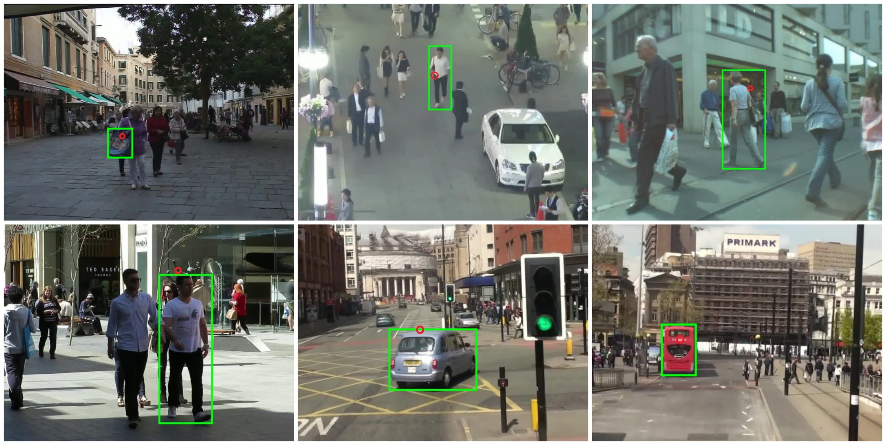
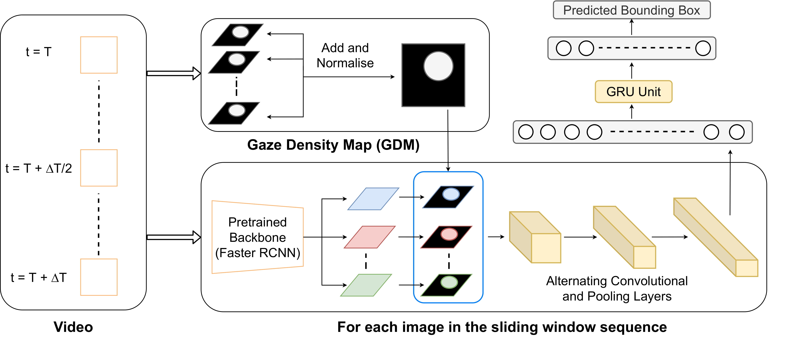
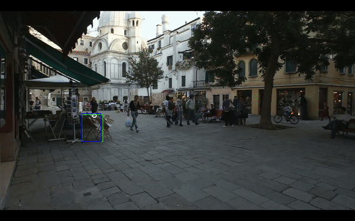

# Decoding Attention from Gaze: A Benchmark Dataset and End-to-End Models

This repository is the PyTorch implementation of the paper "Decoding Attention from Gaze: A Benchmark Dataset and End-to-End Models". The paper studies the use of computer vision tools for attentional decoding, the task of assessing the locus of a participant’ visual attention over time:

 - We provide a publicly available Multiple Object Eye-Tracking (MOET) dataset, an extension to the [Multiple Object Tracking 2016 (MOT16)](https://motchallenge.net/data/MOT16/) benchmark dataset, consisting of gaze data from participants tracking a variety of objects.
 - We propose two end-to-end deep learning models for attentional decoding and compare these to state-of-the-art heuristic methods

<p align="center">
<br>Example frames from stimulus experiments during data collection
</p>

## Requirements

This project is compatible with Python 3.8.10. Necessary dependencies can be found in `requirements.txt` and can be installed using

```bash
pip3 install -r requirements.txt
```

## Training and Evaluating end-to-end Models

<p align="center">
<br>Model achitecture
</p>

Before training, split the videos into frames using `convert_vid_2_frame.py` for easier data loading

```bash
python3 train.py
```

Once the training is done, you can specify the model checkpoint and run inference on the dataset. The following script will generate a CSV file with the predictions.

```bash
python3 generate_pred.py
```

In order to visualise the inference, run the following command

```bash
python3 visualise_pred.py
```
<p align="center">
<br>Example output
</p>

## Evaluating Baseline Algorithms

We compare our end-to-end neural network approach to several baseline algorithms applying deterministic rules:

1. **Fixed Box Baseline:** For each video, the fixed-box baseline predicts a bounding box of fixed size centered around the gaze point. The size of the bounding box is computed as the average size of all bounding box labels, across all participants, for that video.
2. **Object Detector (OD) Baseline:** Using a pretrained model, candidate bounding box predictions are generated for each input frame. If the gaze point is present inside any of the candidate bounding boxes, it is chosen to be the object of interest. Otherwise a random object is selected.
3. **Object Detector (OD) Mod:** It is similar to the above model, with a slight modification in the case when the gaze point doesn’t lie inside any of the candidate bounding boxes. In such a scenario, the nearest bounding box is chosen to be the object of interest, where “nearest” is defined in terms of the Euclidean distance between the gaze point and the nearest pixel of the bounding box.
4. **Object Detector (OD) Oracle:** The model is given access to the true target bounding box and selects the best bounding box out of those provided by the object detector.

The scripts for running these models can be found in `benchmarks/`
